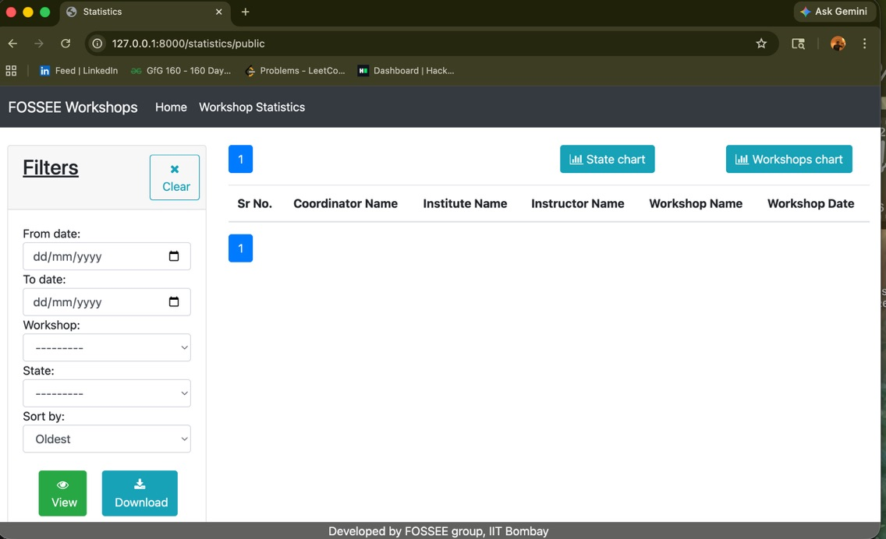
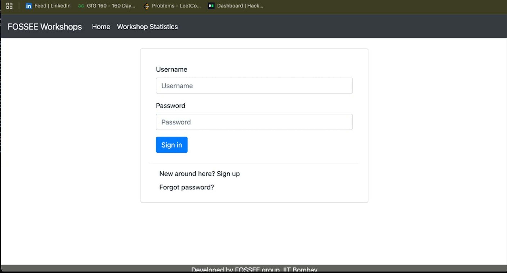
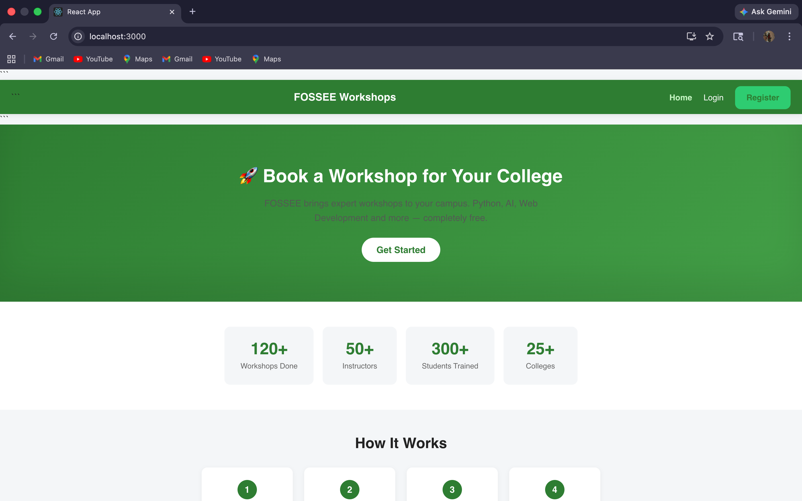
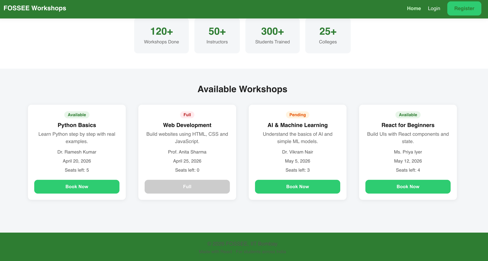
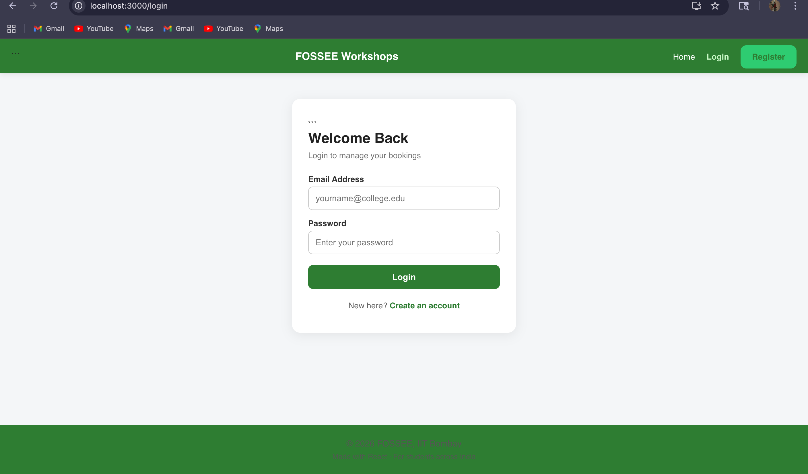
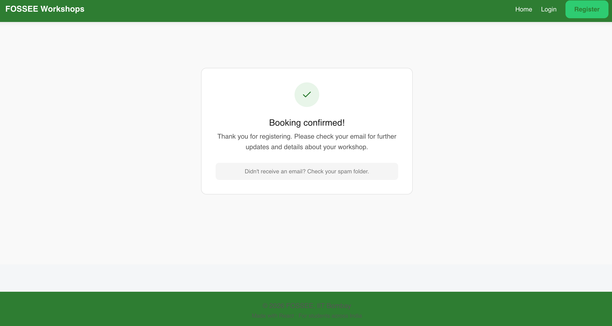
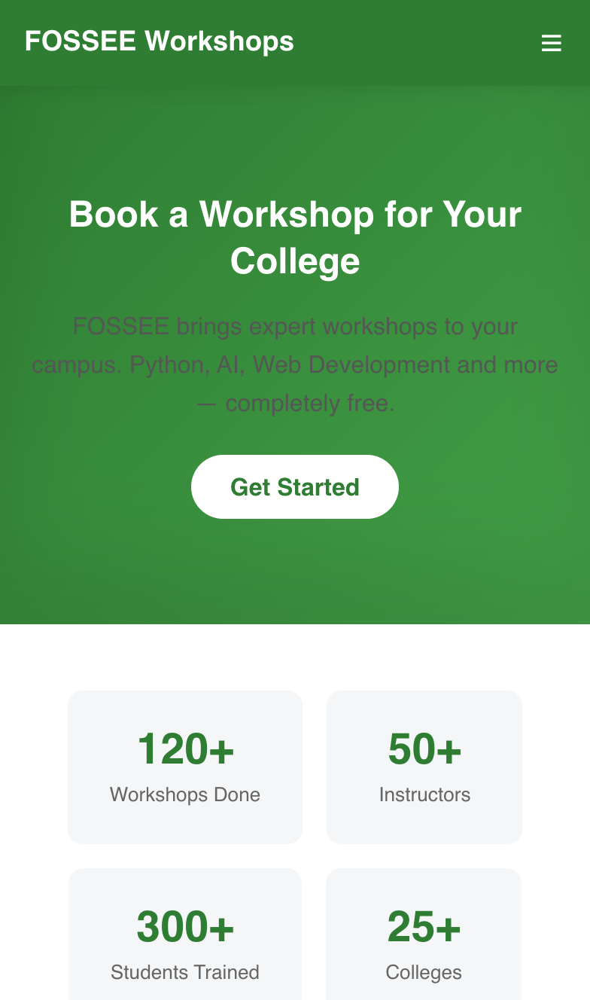
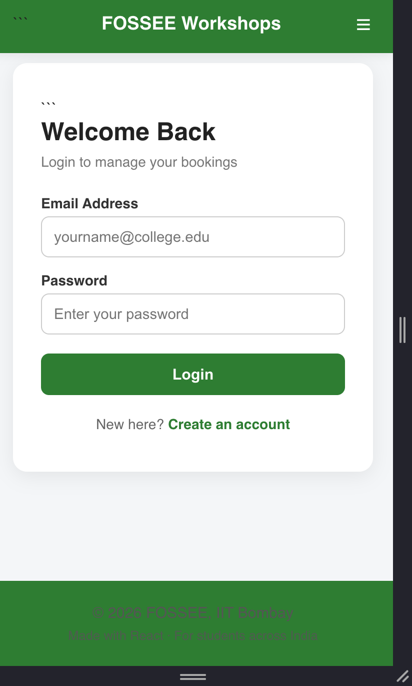
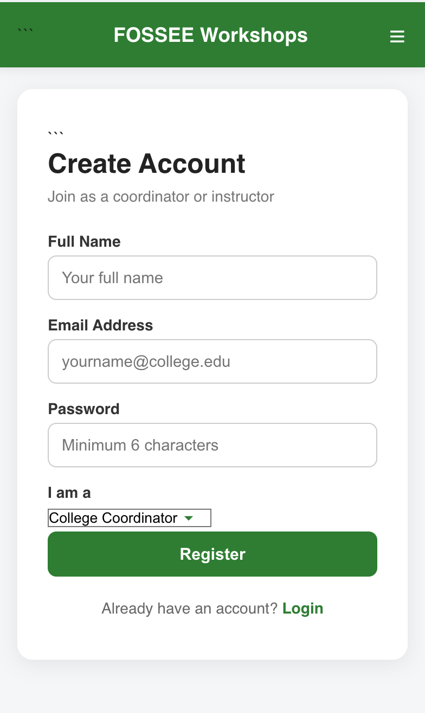

# FOSSEE Workshop Booking – UI/UX Enhancement (React)

Hi, I’m Sri Sakthi P, a first-year student from VIT Chennai.
This project is my submission for the FOSSEE Python Screening Task.

I redesigned the workshop booking portal frontend using React, focusing on improving usability, responsiveness, and visual clarity — while preserving the original functionality.

This project reimagines the frontend using React to create:
	•	A clean and modern interface
	•	Improved navigation and layout
	•	Fully responsive experience across devices

🔗 Live Repo: https://github.com/srisakthipanchanathi-del/workshop-ui

## Project Structure

•/components → reusable UI
•/pages → main pages
•/screenshots → before/after comparison

## Problem Statement

The original interface had several usability issues:
	•	Lack of clear visual hierarchy
	•	Poor differentiation between available and full workshops
	•	Limited responsiveness (not mobile-friendly)
	•	No structured component-based design

 This made it difficult for users to quickly scan workshops and take action.

## Solution Overview

To solve these issues, I redesigned the UI with:
	•	Card-based layout for better structure
	•	Clear status indicators (Available / Full / Pending)
	•	Prominent “Book Now” call-to-action
	•	Improved spacing, typography, and alignment
	•	Fully responsive design

These changes make the interface more intuitive and efficient.

## UX Thinking (Key Improvement)

This redesign is not just visual — it improves how users interact with the system:
User Flow

    •Browse → Identify workshop → Click → Confirm booking

 Decision Making
	•	Clear availability badges reduce confusion
	•	Important actions are highlighted

Clarity Improvements
	•	Reduced cognitive load
	•	Improved readability
	•	Faster scanning of content

 Overall, users can complete tasks faster with less effort.

## UI Improvements

Buttons
	•	“Book Now” made visually prominent
	•	Disabled state for full workshops

Spacing
	•	Consistent spacing system (8px / 16px / 24px)
	•	Better layout structure

Visual Hierarchy
	•	Titles are larger and bold
	•	Descriptions are lighter
	•	Metadata is subtle

Makes the UI feel clean, modern, and professional.

Accessibility Improvements
	•	Semantic HTML structure
	•	Proper contrast for readability
	•	Keyboard-friendly interactions

##  Table of Contents

- [Setup Instructions](#setup-instructions)
- [Tech Stack](#tech-stack)
- [What I Learnt](#what-i-learnt)
- [Design Principles](#design-principles)
- [Responsiveness Approach](#responsiveness-approach)
- [Design vs Performance Trade-offs](#design-vs-performance-trade-offs)
- [Challenges Faced](#challenges-faced)
- [Features](#features)
- [Before & After](#before--after)
- [Conclusion](#conclusion)

## Setup Instructions

• Clone this repo
   git clone https://github.com/srisakthipanchanathi-del/workshop-ui.git

•  Go into the project folder
   cd workshop-ui

• Install packages
   npm install

• Run the app
   npm start

• Open http://localhost:3000 in your browser

## Tech Stack

	•	React (JavaScript)
	•	CSS (Custom styling)
	•	React Router

## What I Learnt

	•	React component structure and reuse
	•	State management using useState
	•	Routing with React Router
	•	Responsive design techniques
	•	Debugging frontend issues
	•	Importance of incremental Git commits

## Design Principles Used

	•	Visual Hierarchy
Clear emphasis on key elements using spacing, contrast, and typography.
	•	Consistency
Reusable UI components for uniform experience.
	•	Simplicity
Clean and distraction-free interface.
	•	Accessibility
Readable text, proper spacing, and user-friendly layout

## Responsiveness Approach

	•	Mobile-first design
	•	Flexbox-based layouts
	•	Adaptive spacing and typography
	•	Tested across mobile, tablet, and desktop

## Design vs Performance Trade-offs

    •   Avoided heavy animations to maintain speed
	•	No bulky UI libraries used
	•	Focused on reusable, lightweight components

## Challenges Faced

	•	Structuring React components efficiently
	•	Understanding routing and page flow
	•	Ensuring consistent responsiveness
	•	Balancing UI improvements with performance

## Features Implemented

	•	Responsive navbar with hamburger menu
	•	Hero section with CTA
	•	Workshop cards with status badges
	•	Login form with validation
	•	Register form with role selection
	•	Reusable components (Navbar, Footer, Cards)
	•	Fully responsive UI

## Screenshots
## Before & After

---

## Before — Original Django Version

<table>
<tr>
<td align="center"><b>Login Page</b></td>
<td align="center"><b>Statistics Page</b></td>
</tr>

<tr>
<td></td>
<td></td>
</tr>
</table>

---
## After — My React Redesign

### Desktop

<table>
<tr>
<td align="center"><b>Home Page</b></td>
<td align="center"><b>Login Page</b></td>
<td align="center"><b>Register Page</b></td>
<td align="center"><b>Booking Confirmation Page</b></td>
</tr>

<tr>
<td></td>
<td></td>
<td></td>
<td></td>

</tr>
</table>

---
### Mobile

<table>
<tr>
<td align="center"><b>Home</b></td>
<td align="center"><b>Login</b></td>
<td align="center"><b>Register</b></td>
</tr>

<tr>
<td></td>
<td></td>
<td></td>
</tr>
</table>

## Conclusion
This project helped me shift from simply writing code to thinking from a user’s perspective.

I focused on improving:
•	Clarity
•	Navigation
•	Responsiveness

while keeping the design simple, efficient, and scalable.

It was a valuable learning experience in building user-friendly interfaces.

