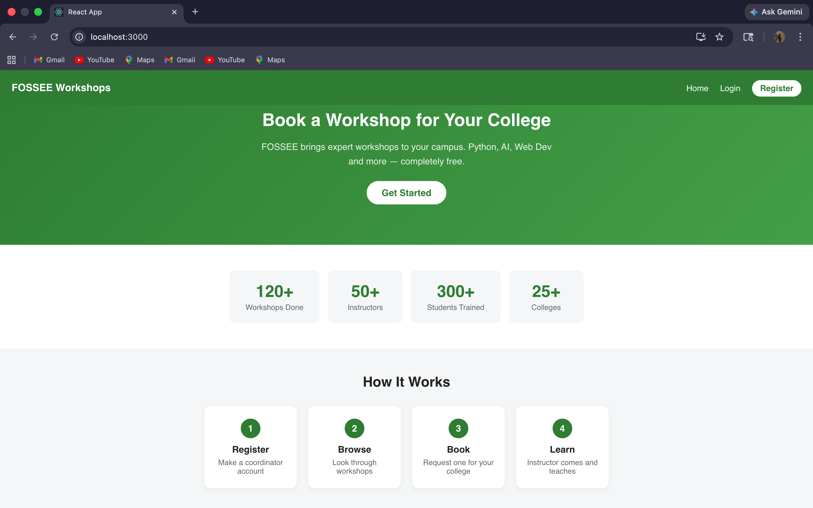
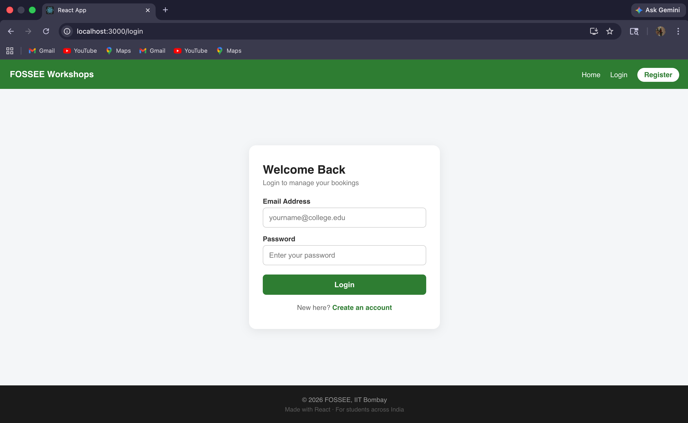
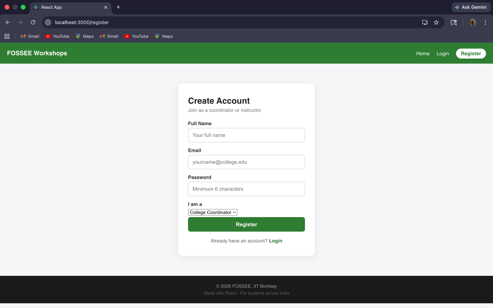
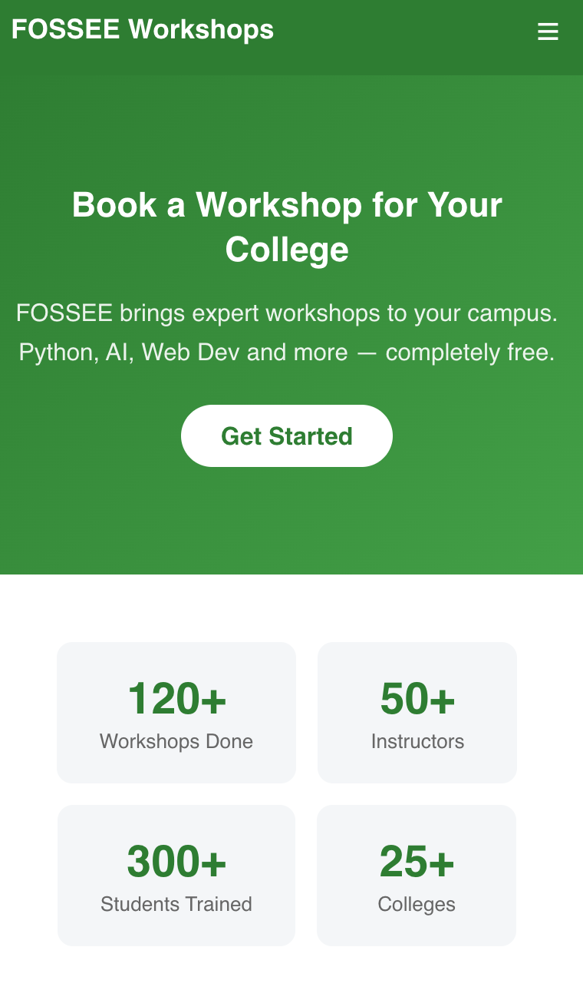
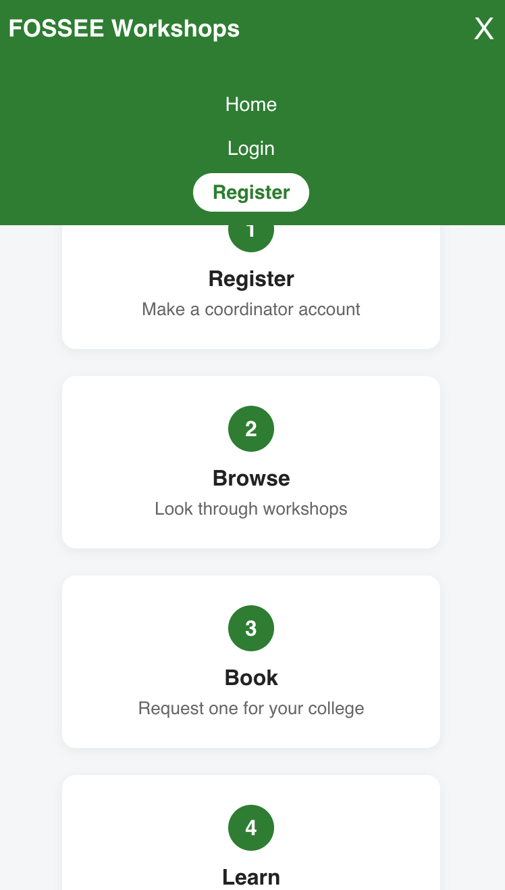
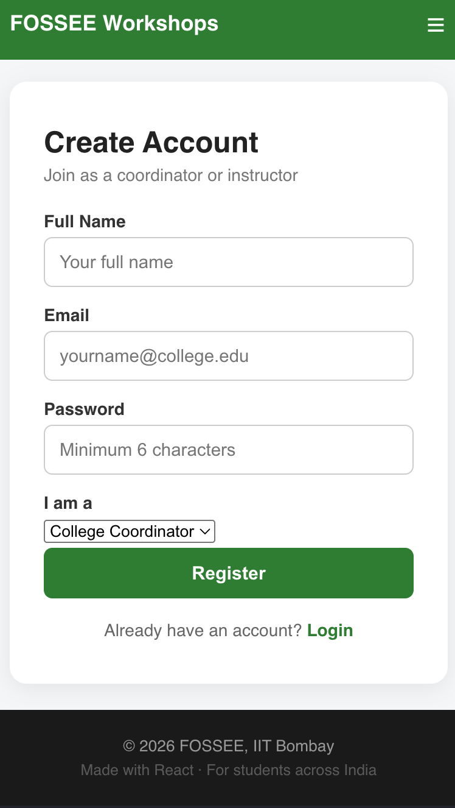

# FOSSEE Workshop Booking – UI/UX Enhancement (React)

Hi, I'm Sri Sakthi P, a first-year student from VIT Chennai.
This is my submission for the FOSSEE Python screening task.

I redesigned the workshop booking portal frontend using React with the goal of improving user experience, responsiveness, and overall visual structure while keeping the core functionality intact.

This was my first complete UI project, and it helped me understand how small design decisions can significantly improve usability.

## Tech Stack
1. React (JavaScript)
2. CSS (Custom styling)
3. React Router

## Design Principles Used

While working on this redesign, I focused on a few key design principles to improve usability:

Visual Hierarchy: Important elements such as headings, workshop cards, and buttons are emphasized using spacing, size, and contrast. This helps users quickly identify key actions.

Consistency: Similar UI components like buttons, forms, and cards follow a consistent style throughout the application.

Simplicity: I avoided unnecessary elements and kept the interface clean so users can navigate easily without confusion.

Accessibility: Proper spacing, readable font sizes, and contrast were considered to make the interface usable for a wider range of users.

## Responsiveness Approach

The application is designed with a mobile-first mindset, considering that most users access such platforms from their phones.

1. Used Flexbox and responsive layouts to adapt content across different screen sizes.
2. Adjusted font sizes, spacing, and alignment for smaller devices.
3. Ensured that navigation and forms are easy to interact with on mobile.
4. Tested the layout across mobile, tablet, and desktop views.

## Design vs Performance Trade-offs

While improving the UI, I made some practical trade-offs:
1. Focused on clean and efficient styling instead of heavy animations to maintain performance.
2. Avoided large external UI libraries to keep the application lightweight.
3. Kept components simple and reusable to ensure maintainability.

## Challenges Faced

1. Initially, structuring components properly in React was challenging and required multiple iterations.

2. Implementing routing and organizing pages in a clean way took time to understand.

3. Making the design responsive across multiple screen sizes required careful adjustments.

4. Balancing visual improvements without affecting performance was an important learning experience.

## Features Implemented

1. Responsive navbar with hamburger menu
2. Home page with hero section, stats, and workshop cards
3. Login page with validation and error handling
4. Register page with role selection
5. Reusable components (Navbar, Footer, Cards)
6. Fully responsive layout for mobile devices

## Setup Instructions

1. Clone this repo
   git clone https://github.com/srisakthipanchanathi-del/workshop-ui.git

2. Go into the project folder
   cd workshop-ui

3. Install packages
   npm install

4. Run the app
   npm start

5. Open http://localhost:3000 in your browser

## Screenshots

### Before
The original site was built with Django HTML templates - 
basic styling, not mobile friendly, no component structure.
Original repo: https://github.com/FOSSEE/workshop_booking

### After - My React Redesign

### Desktop - Home Page

### Desktop - Login Page

### Desktop - Register Page

### Mobile - Home Page

### Mobile - Home Page (Alt View)

### Mobile - Register Page

## What I Learned

1. React component structure and reuse
2. useState for managing UI state
3. React Router for navigation
4. Responsive design using CSS media queries
5. Debugging frontend issues effectively
6. Importance of small, incremental Git commits

## Conclusion
This project helped me move beyond just writing code and start thinking from a user's perspective. I focused on improving clarity, navigation, and responsiveness while keeping the design simple and efficient.

It was a valuable experience in understanding how UI/UX improvements can make an application more 
user- friendly and effective.

